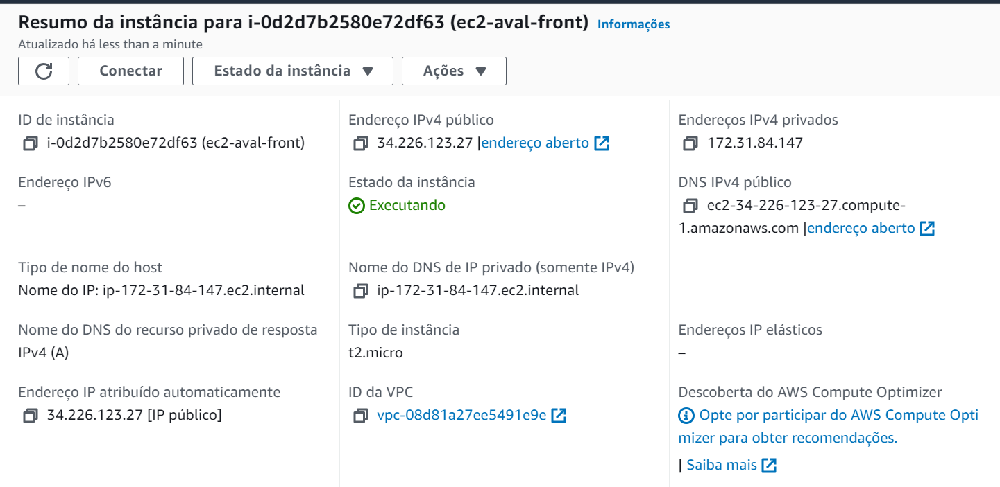
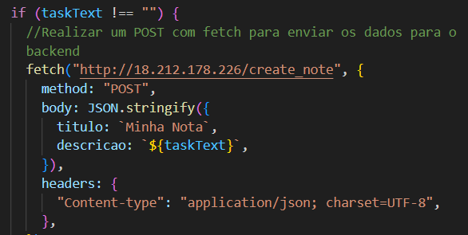
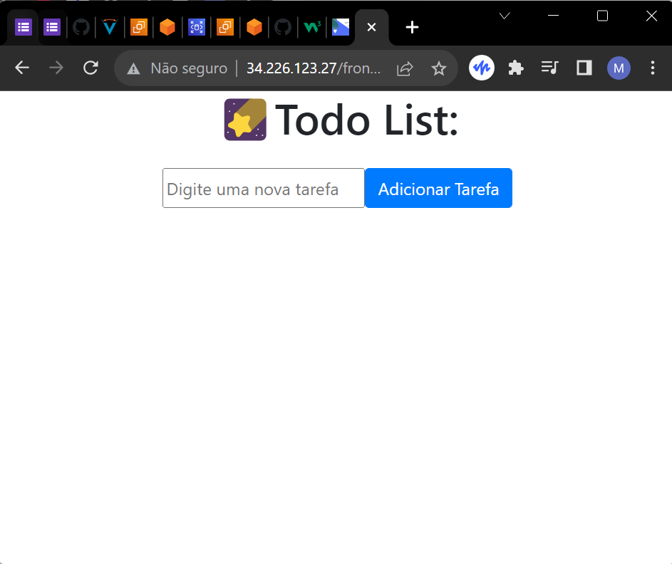
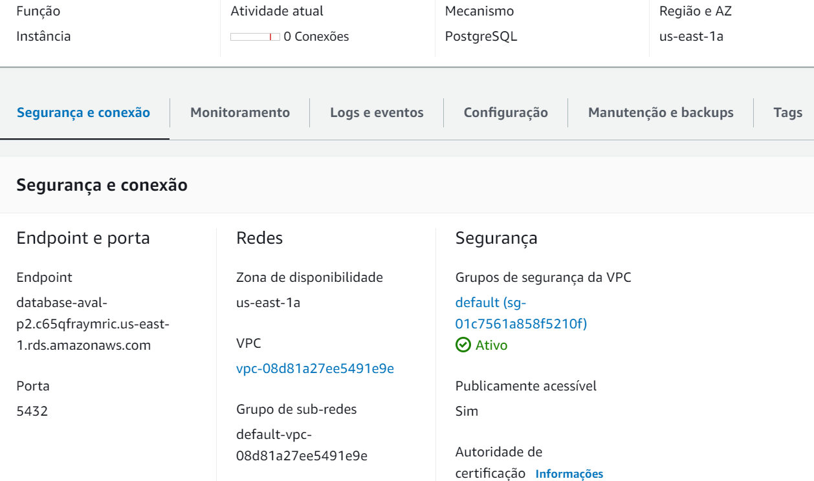
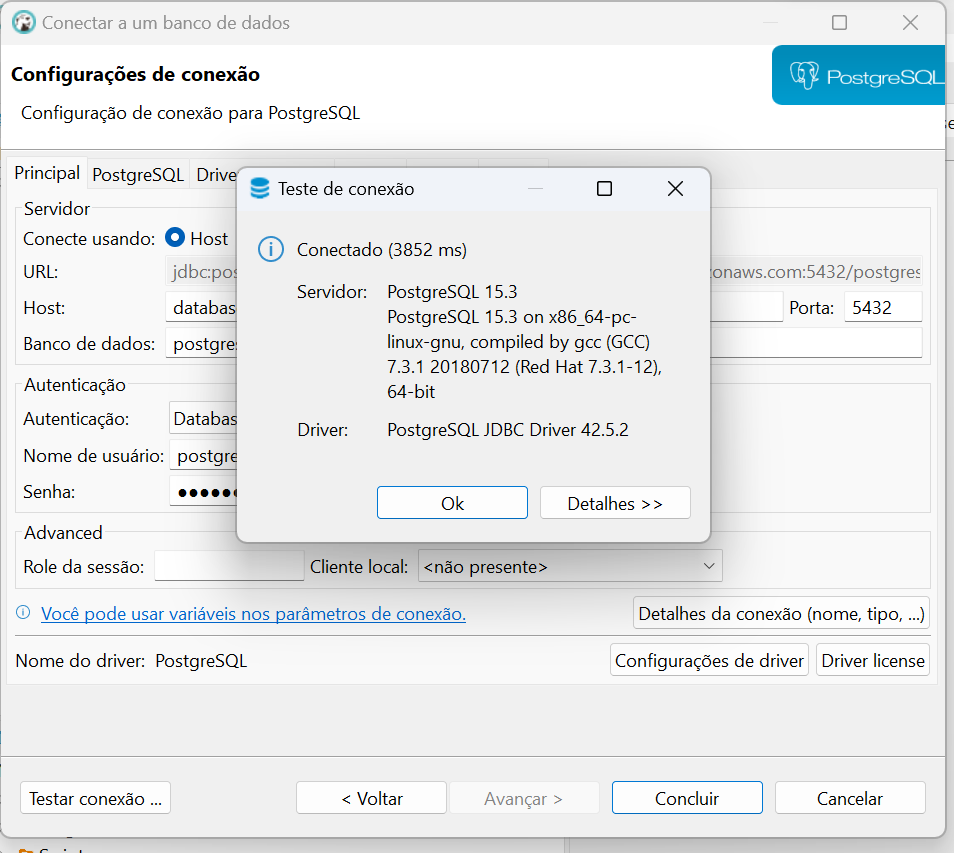
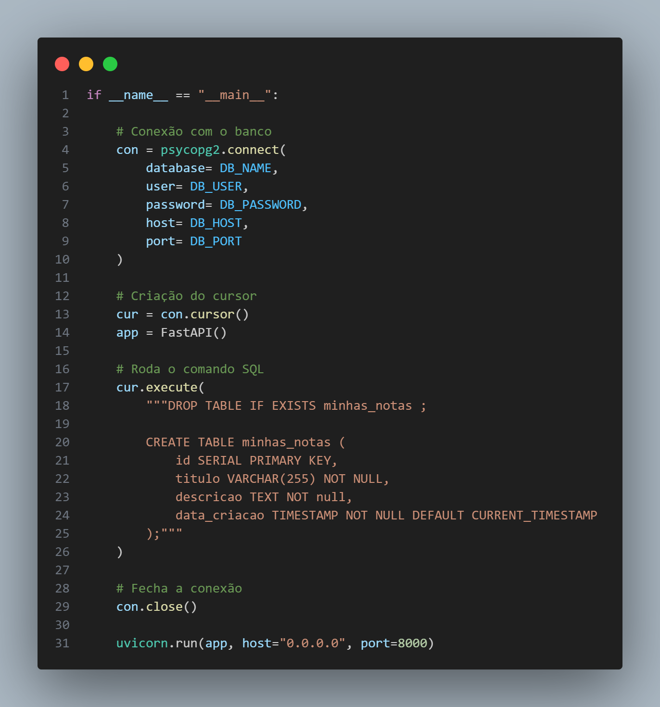
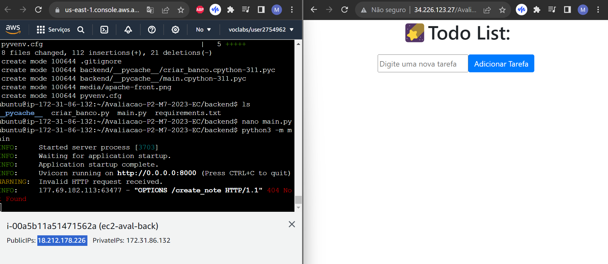

Print das etapas abaixo que funcionam

Informações do EC2 do front

Frontend puxando do endereço do backend

Frontend Rodando a partir do Apache Web Server

Informações do RDS do banco de dados

Conexão testada pelo dbeaver

Fiquei uma hora para conseguir criar a tabela mesmo com o rds e ambos ec2 ja criados e rodando, abaixo a gambiarra que fiz:

Meu atraso:

Por conta disso não consegui integrar, apesar do front end estar puxando do backend todas as informações:

Comunicação acontencendo apesar do erro

